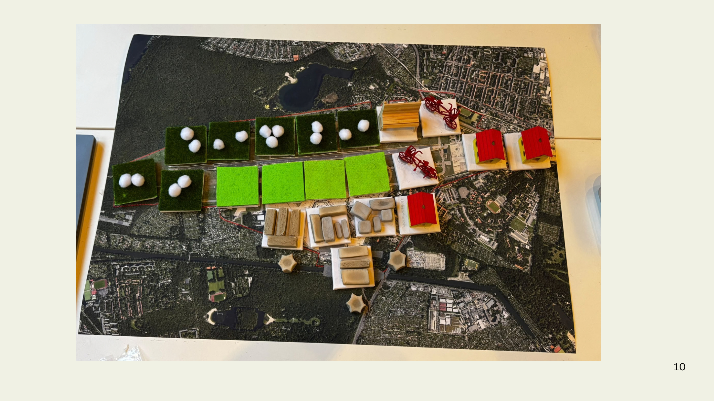

# Tegel im Tausch – Spielanleitung

Ein Legespiel über das ehemalige Flughafengelände Berlin-Tegel. Du veränderst, wie eine Fläche genutzt wird, und siehst sofort, wer oder was dafür weichen muss.

| | |
|---|---|
| **Für wen** | Kinder, Jugendliche und alle ohne Planungswissen |
| **Alter** | ab 6 Jahren, weil das Spiel Kleinteile enthält, die verschluckt werden können |
| **Mitspielende** | Einzelspiel: Jede Person gestaltet das Feld selbst |
| **Dauer** | kein festes Ende |
| **Gewinner** | keiner – es gibt keine Punkte |

## 1. Worum geht es?

Auf dem Gelände in Tegel wollen viele etwas: Menschen suchen Wohnungen, Firmen brauchen Platz, Besucher möchten sich erholen, Tiere und Pflanzen brauchen ihren Lebensraum. Eine Fläche kann aber immer nur eine Nutzung haben.

Darum tauschst du die Nutzungsart und die damit verbundenen Komponenten der Flächen aus. Jeder Tausch bringt etwas Neues auf die Karte und verdrängt etwas anderes. Das Verdrängte landet in der **Verlust-Box**. So wird sichtbar, was eine Entscheidung kostet.

Du wirst merken: Einen Aufbau, mit dem alle zufrieden sind, gibt es nicht. Genau das ist die Erkenntnis des Spiels.

## 2. Spielmaterial

### Karte

Ein Luftbild des Geländes im Format A1. Das Gelände ist in 22 Zonen eingeteilt. Jeder Baustein auf der Karte steht für eine Zone.

### Nutzungsbausteine

Auf jeder Zone liegt immer genau ein Baustein. Er zeigt, wie die Fläche genutzt wird. Jeder Baustein besteht aus einem Boden und, bei bebauten Flächen, einem Aufsatz.

| Kürzel | Nutzung | Boden | Aufsatz | Bedeutung |
|---|---|---|---|---|
| **K** | Koppel | dunkelgrün | – | Naturschutz und natürlicher Lebensraum, Koppeln für Tiere, kein Zugang für Besucher |
| **GA** | Grünanlage | hellgrün | – | Grünfläche mit Zugang für Besucher, keine Weidetiere |
| **W** | Wohnen | weiß | Haus mit rotem Dach | Wohngebäude, zum Beispiel im Schumacher Quartier |
| **Ge** | Gewerbe | weiß | graue Tonblöcke | Unternehmen oder Bildungseinrichtungen |
| **Er/Fr** | Erholung/Freizeit | weiß | rotes Fahrrad | Freizeit und Erholung für Menschen |

Der Boden zeigt, ob eine Fläche versiegelt ist:

- **Dunkelgrün und hellgrün** stehen für unversiegelten, grünen Boden.
- **Weiß** steht für betonierten Boden. Er ist die Grundlage für Wohnen, Gewerbe und Erholung/Freizeit.

Wechselt ein Tausch zwischen grünem und weißem Boden, wird versiegelt oder entsiegelt. Dann kommt ein VSM oder ESM ins Spiel, siehe [Abschnitt 5](#5-plus-und-minus).

### Marker

Marker zeigen, wer eine Fläche nutzt oder was sie auszeichnet. Sie liegen auf dem Baustein, zu dem sie gehören.

| Marker | Farbe und Form | Gehört zu |
|---|---|---|
| Tiere | weiß | Koppel |
| Pflanzen | dunkelgrün | Koppel und Grünanlage |
| **NSM** – Naturschutzmarker | pink | Koppel |
| Besucher | orange | Grünanlage und Erholung/Freizeit |
| Anwohner | schwarz | Wohnen |
| Beschäftigte | blau | Gewerbe |
| **DMS** – Denkmalschutzmarker | gelber Stern | einzelne Gewerbebausteine |
| **VSM** – Versiegelungsmarker | altrosa | keinem Baustein |
| **ESM** – Entsiegelungsmarker | beige | keinem Baustein |

VSM und ESM sind Aufwandsmarker. Sie zeigen, was Versiegeln und Entsiegeln kostet, und liegen nie auf der Karte.

### Zwei Boxen

- **Tauschbox:** der Vorrat. Hier liegen alle Bausteine und Marker, die gerade nicht im Spiel sind.
- **Verlust-Box:** deine „Hand". Hier landet alles, was durch einen Tausch von der Karte verdrängt wurde, und der Aufwand für Versiegeln und Entsiegeln.

### Tauschmatrix

Die Tabelle in [Abschnitt 6](#6-die-tauschmatrix). Sie sagt dir bei jedem Tausch, welche Marker sich bewegen.

## 3. Aufbau

1. Lege die Karte in die Mitte.
2. Setze die Bausteine so auf die Karte wie auf dem Foto oben.
3. Lege auf jeden Baustein seine Marker:

   | Baustein | Marker zum Start |
   |---|---|
   | Koppel | Tiere, Pflanzen, NSM |
   | Grünanlage | Pflanzen, Besucher |
   | Wohnen | Anwohner |
   | Gewerbe | Beschäftigte |
   | Erholung/Freizeit | Besucher |

4. Lege die drei DMS-Sterne zu den Gewerbebausteinen, bei denen sie auf dem Foto liegen.
5. Alle VSM und ESM und alle übrigen Bausteine und Marker kommen in die Tauschbox.
6. Die Verlust-Box bleibt leer.
7. Lege die Tauschmatrix gut sichtbar daneben.

Das Foto zeigt einen früheren Stand: Die meisten Marker liegen noch nicht auf den Bausteinen, und statt der Bank steht heute ein Fahrrad.

## 4. So läuft ein Zug

Du spielst allein und gestaltest das Feld nach deinen Vorstellungen. Ein Zug ist ein Tausch.

1. **Zone wählen.** Suche dir einen Baustein auf der Karte aus. Das ist die Nutzung, die **da ist**.
2. **Neue Nutzung wählen.** Entscheide, was aus der Fläche werden soll. Das ist die Nutzung, zu der sie **wird**.
3. **Baustein tauschen.** Nimm den alten Baustein von der Karte und lege ihn in die Verlust-Box. Setze den neuen Baustein auf die Zone.
4. **Matrix lesen.** Suche oben die Spalte „ist da" und links die Zeile „wird zu". In der Zelle, in der sich beide treffen, stehen die Markerbewegungen.
5. **Marker bewegen.** Führe jede Angabe der Zelle einmal aus, wie in [Abschnitt 5](#5-plus-und-minus) erklärt.
6. **Hinschauen.** Schau auf die Karte und in die Verlust-Box, bevor du den nächsten Zug machst.

Bausteine werden immer ausgetauscht und nie gestapelt.

## 5. Plus und Minus

### Plus: Das geht verloren

`+ Marker` heißt: Der Marker kommt in die Verlust-Box.

- Tiere, Pflanzen, Besucher, Anwohner, Beschäftigte, NSM und DMS werden verdrängt. Du nimmst sie vom alten Baustein.
- VSM und ESM stehen für Aufwand. Du nimmst sie aus der Tauschbox.

### Minus: Das kommt neu dazu

`− Marker` heißt: Der Marker kommt ins Spiel und wird auf den neuen Baustein gelegt.

- Liegt der Marker schon in der Verlust-Box, nimmst du ihn von dort.
- Liegt er dort nicht, nimmst du ihn aus der Tauschbox. Im ersten Zug ist das immer so, weil die Verlust-Box noch leer ist.

Dieselbe Regel gilt für den neuen Baustein in Schritt 3: zuerst in der Verlust-Box nachsehen, sonst aus der Tauschbox nehmen.

### Versiegeln und Entsiegeln kosten immer

- Wird eine grüne Fläche bebaut, kommt ein **VSM** in die Verlust-Box.
- Wird eine bebaute Fläche wieder grün, kommt ein **ESM** in die Verlust-Box.
- Beide Marker bleiben für den Rest des Spiels dort. Du wirst sie nicht wieder los.
- Wer erneut versiegelt oder entsiegelt, bekommt einen weiteren Marker dazu.

Der Aufwand lässt sich also nicht rückgängig machen. Wer eine Fläche bebaut und später wieder begrünt, hat beides in der Verlust-Box: den VSM und den ESM.

### Null

`0` heißt: Die Nutzung bleibt gleich, nichts bewegt sich.

### Auf einen Blick

| Zeichen | Bedeutung | Weg |
|---|---|---|
| `+` Akteur, NSM, DMS | wird verdrängt | Karte → Verlust-Box |
| `+` VSM, ESM | Aufwand entsteht | Tauschbox → Verlust-Box, bleibt dort |
| `−` | kommt neu dazu | Verlust-Box oder Tauschbox → Karte |
| `0` | keine Änderung | – |

## 6. Die Tauschmatrix

**Spalte** = Nutzung, die da ist. **Zeile** = Nutzung, zu der die Fläche wird.

| wird zu ↓ / ist da → | Koppel | Grünanlage | Wohnen | Gewerbe | Erholung/Freizeit |
|---|---|---|---|---|---|
| **Koppel** | 0 | + Besucher − Tiere − NSM | + ESM + Anwohner − NSM − Pflanzen − Tiere | + ESM + Beschäftigte + DMS − NSM − Tiere − Pflanzen | + ESM + Besucher − NSM − Tiere − Pflanzen |
| **Grünanlage** | + NSM + Tiere − Besucher | 0 | + ESM + Anwohner − Pflanzen − Besucher | + ESM + Beschäftigte + DMS − Tiere − Pflanzen − Besucher | + ESM − Pflanzen |
| **Wohnen** | + VSM + Tiere + NSM + Pflanzen − Anwohner | + VSM + Pflanzen + Besucher − Anwohner | 0 | + Beschäftigte + DMS − Anwohner | + Besucher − Anwohner |
| **Gewerbe** | + VSM + NSM + Tiere + Pflanzen − Beschäftigte | + VSM + Pflanzen + Besucher − Beschäftigte | + Anwohner − Beschäftigte | 0 | + Besucher − Beschäftigte |
| **Erholung/Freizeit** | + VSM + NSM + Tiere + Pflanzen − Besucher | + VSM + Pflanzen | + Anwohner − Besucher | + Beschäftigte + DMS − Besucher | 0 |

Die Matrix stammt aus unserem Workshop am Whiteboard: [Originalfoto](docs/assets/tauschmatrix_original.jpg). Gegenüber dem Foto haben wir zwei Dinge festgelegt: Der VSM ist wie der ESM ein Aufwandsmarker und steht deshalb mit Plus. Die am Whiteboard eingeklammerten Pflanzen-Einträge gelten.

## 7. Zwei Beispielzüge

### Erster Zug: Aus einer Koppel wird Wohnen

Spalte **Koppel**, Zeile **Wohnen**: `+ VSM, + Tiere, + NSM, + Pflanzen, − Anwohner`

1. Der Koppelbaustein kommt von der Karte in die Verlust-Box.
2. Ein Wohnbaustein aus der Tauschbox kommt auf die Zone.
3. Tiere, NSM und Pflanzen kommen in die Verlust-Box.
4. Ein VSM aus der Tauschbox kommt in die Verlust-Box, weil die Fläche versiegelt wird.
5. Ein Anwohner-Marker aus der Tauschbox kommt auf den Wohnbaustein.

**Was du siehst:** Es gibt neuen Wohnraum. Dafür liegen ein Lebensraum, seine Tiere und Pflanzen, der Naturschutz und der Aufwand der Versiegelung in der Verlust-Box.

### Zweiter Zug: Aus Wohnen wird eine Grünanlage

Spalte **Wohnen**, Zeile **Grünanlage**: `+ ESM, + Anwohner, − Pflanzen, − Besucher`

1. Ein Wohnbaustein kommt von der Karte in die Verlust-Box.
2. Ein Grünanlagenbaustein aus der Tauschbox kommt auf die Zone.
3. Der Anwohner-Marker kommt in die Verlust-Box.
4. Ein ESM aus der Tauschbox kommt in die Verlust-Box, weil die Fläche entsiegelt wird.
5. Der Pflanzen-Marker liegt seit dem ersten Zug in der Verlust-Box. Er kommt von dort auf die Grünanlage.
6. Ein Besucher-Marker aus der Tauschbox kommt auf die Grünanlage.

**Was du siehst:** Die Pflanzen sind zurück, aber an anderer Stelle und ohne Tiere und Naturschutz. Anwohner haben ihren Platz verloren. In der Verlust-Box liegen jetzt zwei Aufwandsmarker, der VSM und der ESM, und beide bleiben dort.

## 8. Besondere Fälle

- **Ein Plus-Marker liegt nicht auf dem Baustein:** Dieser Schritt entfällt. Das betrifft vor allem den DMS, der nur bei einzelnen Gewerbebausteinen liegt.
- **Ein Minus-Marker ist in keiner Box mehr vorhanden:** Der Schritt entfällt. Überlege kurz, warum er fehlt.
- **VSM und ESM:** Sie kommen nie auf die Karte und nie zurück in die Tauschbox.
- **Denkmalschutz:** Einen DMS kann man nur abbauen. Ein verlorenes Denkmal kommt im Spiel nicht zurück auf die Karte.
- **Alle Tausche sind erlaubt.** Das Spiel sagt nichts darüber, ob eine Nutzung in echt zulässig wäre.

## 9. Wann ist das Spiel zu Ende?

Das Spiel hat kein festes Ende. Du hörst auf, wenn du merkst: Egal wie ich tausche, irgendetwas landet immer in der Verlust-Box.

Diese Fragen helfen dir beim Nachdenken, nach jedem Zug und am Schluss. Du kannst sie danach auch mit anderen besprechen:

- Wer hat durch den Tausch etwas gewonnen?
- Was liegt jetzt in der Verlust-Box, und wer vermisst es?
- Konnte ich etwas zurückholen? Was musste ich dafür abgeben?
- Was lässt sich gar nicht zurückholen?
- Gibt es einen Aufbau, mit dem alle zufrieden wären?
- Wie würdest du entscheiden, wenn es deine Stadt wäre?

## 10. Kurzfassung

1. Zone wählen.
2. Neue Nutzung wählen.
3. Alten Baustein in die Verlust-Box, neuen auf die Zone.
4. Matrix lesen: Spalte „ist da", Zeile „wird zu".
5. `+` in die Verlust-Box, `−` auf den neuen Baustein. VSM und ESM bleiben in der Verlust-Box.
6. Hinschauen und nachdenken.

## Hinweis

Das Spiel vereinfacht stark. Bausteine und Marker stehen für Arten von Nutzungen und Betroffenen, nicht für Flächengrößen, Personenzahlen oder Messwerte. Es ersetzt keine Planung und keine rechtliche Prüfung.
