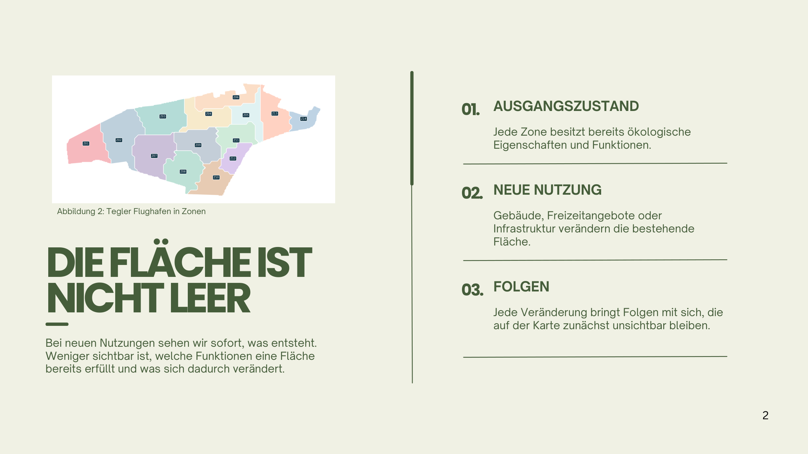
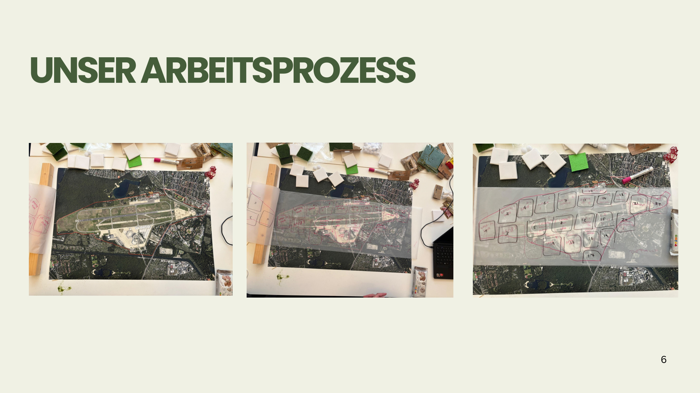
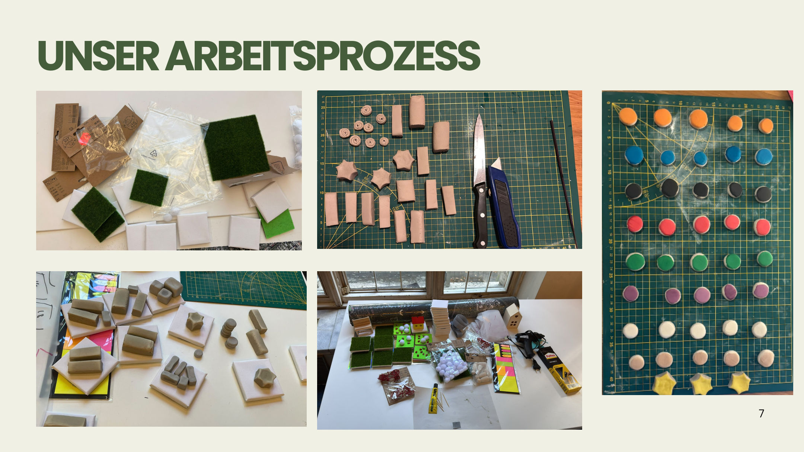

# Setzen. Tauschen. Folgen sichtbar machen.

Technische Dokumentation des physischen Tegel-Modells

Arbeitsfassung vom 4. Oktober 2026. Team: Thao Trang Le (Anny), Linda Izadi Sharifbad, Fatih Koc und Marcel Do.

Diese Fassung beschreibt den verfügbaren Projektstand anhand der Abschlusspräsentation, des Whiteboard-Fotos, der Übergabe, der anschließenden Erläuterungen und der am 04.10.2026 bereitgestellten Zonenzuweisung. Unsichere Originalregeln und neue Empfehlungen werden ausdrücklich unterschieden.

## 1. Projekt und Zielsetzung

Flächen erscheinen in Planungsprozessen mitunter frei oder leer. Tatsächlich besitzen sie bereits ökologische, räumliche und gesellschaftliche Funktionen. Eine neue Nutzung kann Wohnraum, Arbeitsplätze oder Freizeitangebote schaffen und zugleich andere Funktionen verändern oder verdrängen.

Das Projekt macht diese Nutzungskonflikte über ein physisches, datenbasiertes und interaktives Modell erfahrbar. Eine Zone wird ausgewählt, ihre Nutzung verändert und die Folgen werden anhand von Akteuren und Markern verglichen. Im Mittelpunkt steht das Verständnis von Trade-offs, nicht die Ermittlung einer optimalen Planung.

Die Zielgruppe umfasst vor allem Kinder und jüngere Menschen, außerdem Besucher und Interessierte ohne planerisches Fachwissen. Die Vereinfachung soll einen verständlichen Gesprächsanlass schaffen. Die Regeln liefern keine belastbaren räumlichen Prognosen.

## 2. Untersuchungsgebiet und Ausgangszustand

Betrachtet wird das gesamte Gelände des ehemaligen Flughafens Berlin-Tegel, nicht ausschließlich die Tegeler Stadtheide. Das Gelände wurde nach Projektbeschreibung in 22 Zonen gegliedert. Die gelieferte Tabelle enthält dagegen 23 eindeutige `zone_id`-Werte. Bis zum Abgleich mit der Karte wird keine Tabellenzeile entfernt oder zusammengelegt.

Der Ausgangszustand verbindet bestehende Eigenschaften mit einzelnen berücksichtigten Entwicklungsplanungen. Im östlichen Bereich wurden geplante Wohnquartiere bereits als Zonen 22 und 23 aufgenommen. Er ist daher kein vollständig historischer Zustand zu einem einheitlichen Stichtag. Die genaue räumliche Zuordnung der 23 Tabellenzeilen zur 22-Zonen-Karte bleibt zu klären.

## 3. Datengrundlage

Die räumlichen Grundlagen stammen laut Projektunterlagen hauptsächlich aus dem FUTR HUB Geoportal und dem Entwicklungs- und Pflegekonzept zur Tegeler Stadtheide. Luftbild, Versiegelung und Projektgrenze halfen bei der räumlichen Orientierung. Das Konzept lieferte Informationen zu vorgesehenen Nutzungen und räumlichen Zusammenhängen.

| Grundlage | Rolle im Projekt | Nachweis |
|---|---|---|
| Luftbild | Grundkarte und räumliche Orientierung | Präsentation, Folie 4 |
| Versiegelung | Vergleich der Oberflächenzustände | Präsentation, Folie 4 |
| Projektgrenze | Abgrenzung des betrachteten Geländes | Präsentation, Folie 4 |
| Entwicklungs- und Pflegekonzept | Interpretation bestehender und geplanter Funktionen | Präsentation, Folien 4 und 17 |
| Excel-Arbeitsdatei | strukturierte Zonenattribute | `data/zones.xlsx`; bereitgestellt am 04.10.2026 |

Die Arbeitsdatei nennt projektinterne Quelltypen wie Kartenfolie / EPK, Denkmalkarte, Freiraumplanung, Kompensationskonzept und Masterplan Schumacher Quartier. Konkrete Layernamen, Datenstände, Abrufdaten und die verwendete Konzeptversion sind noch zu ergänzen. Diese Dokumentation erfindet keine Metadaten. Rechtliche Ausgleichs- oder Ersatzpflichten werden nicht aus der vereinfachten Modelllogik abgeleitet.

## 4. Datenaufbereitung und Werkzeuge

Im FUTR HUB wurden relevante Karteninformationen betrachtet und miteinander verglichen. Figma diente als Sammelboard für Karten und Screenshots. Es wurde nicht als GIS-Analysewerkzeug eingesetzt.

QGIS wurde zum Import des Luftbilds, zur Auswahl des Ausschnitts und zur Druckvorbereitung im A1-Format verwendet. Eine automatisierte Zonierung oder weitergehende GIS-Analyse war kein Bestandteil des finalen Vorgehens.

Ein zwischenzeitlicher Python-Ansatz zur Datenaufbereitung beziehungsweise Zonierung wurde verworfen, weil die manuelle Lösung für das Projekt angemessener war. Er ist kein Bestandteil der reproduzierten Modellmethode. Das PDF-Erzeugungsskript in diesem Repository dient ausschließlich der Dokumentation.

## 5. Manueller Zonierungsprozess

Die Zonierung entstand durch den Vergleich mehrerer Karteninformationen: insbesondere Naturschutz, Denkmalschutz, Versiegelung, bestehende und geplante Nutzungen sowie räumliche Struktur. Die Zoneinteilung wurde nicht unmittelbar aus einem einzelnen GIS-Layer übernommen.

Das Team wählte Karten aus, verglich deren Informationen, druckte die Grundkarte und skizzierte Grenzen auf einer transparenten Folie. Die Zonen orientierten sich sowohl an räumlichen Eigenschaften als auch an den rechteckigen Grundplatten der physischen Bausteine.

Die 22 Zonen sind somit eine projektbezogene Interpretation aus Daten, Modellanforderungen und physischer Darstellbarkeit. Sie sind keine unabhängig bestätigten Verwaltungs-, Schutzgebiets- oder Planungseinheiten. Für einen identischen Nachbau fehlen noch eine druckfähige Grundkarte und eindeutig zuordenbare Zonengrenzen.

## 6. Zonendatenmodell

Die Excel-Tabelle ist die strukturierte Arbeitsgrundlage für die Eigenschaften der Zonen. Die bereitgestellte Datei wird unverändert als `data/zones.xlsx` aufbewahrt. Ihr einziges Tabellenblatt `Tabelle1` enthält 23 Datenzeilen und zehn vollständig befüllte Spalten. `data/zones.csv` ist der verlustfreie UTF-8-Export für Versionsvergleich und Weiterverarbeitung; `data/data_dictionary.md` beschreibt die Felder.

| Feldgruppe | Spalten | Rolle |
|---|---|---|
| Identifikation | `zone_id` | eindeutige Tabellenkennung 1 bis 23 |
| räumlich-fachliche Einordnung | `Hauptkategorie`, `Unterkategorie`, `Aktuelle Nutzung`, `Flächentyp` | Beschreibung des Ausgangskontexts |
| Nutzung und Beteiligte | `Zugang`, `Akteure`, `Beweidung` | Hinweise für Besucher-, Akteurs- und Tierdarstellungen |
| Schutz und Herkunft | `Schutzstatus`, `Datenquelle` | Kontext und projektinterner Herkunftshinweis |

13 Einträge gehören zur Hauptkategorie Naturschutzgebiet und natürlicher Lebensraum, drei zu Flughafenbestand / Denkmalschutz, fünf zu Freizeit / Erholung und zwei zu Wohnen / Quartier. 16 Zonen sind als eingeschränkt, sieben als öffentlich zugänglich gekennzeichnet; 13 Einträge nennen Beweidung. Diese Summen beschreiben nur die gelieferte Tabelle.

Die Tabellenbegriffe sind nicht automatisch mit den fünf vereinfachten Nutzungen der Tauschmatrix gleichzusetzen. Insbesondere sind aktuelle Nutzung, Flächentyp und Schutzstatus Kontextattribute und keine Transformationsregeln. Geometrien, Flächengrößen und quantitative Wirkungen enthält die Datei nicht.

Die Abweichung zwischen 23 Tabellenzeilen und 22 Zonen in Projektbeschreibung und Karte ist offen. Denkbar sind eine zusätzliche Zone, eine Teilzone oder eine abweichende Nummerierungslogik; ohne Teamabgleich wird keine dieser Erklärungen als Tatsache übernommen.

## 7. Physisches Modell

Das Modell besteht aus Grundkarte, Nutzungsbausteinen, Akteurs- und Zustandsmarkern, Tauschstapel und gemeinsamer Verlustbox. Die Präsentation zeigt die Herstellung und den Aufbau.

### Flächentypen

| Darstellung | Bedeutung im vereinfachten Modell |
|---|---|
| Dunkelgrün | Naturschutzbereich/natürlicher Lebensraum, Koppeln; laut Modelllegende kein Besucherzugang |
| Hellgrün | zugängliche Grün- und Freifläche für Besucher; keine Weidetiere |
| Betoniert | Untergrund für Wohn-, Gewerbe- sowie Erholungs-/Freizeitnutzung |

Diese Kategorien sind die Modelllegende, keine allgemeingültige Aussage über reale Schutzgebiete oder jede Form von Freizeitnutzung.

### Nutzungen und Symbole

| Kürzel | Nutzung | Symbol laut Projektunterlagen |
|---|---|---|
| K | Koppel/naturnaher Bereich | Koppelbaustein auf dunkelgrünem Boden |
| GA | Grünanlage | hellgrüner Flächenbaustein |
| W | Wohnen | Haus/Quartier |
| Ge | Gewerbe | Tonblöcke, auch Unternehmen/Bildungseinrichtungen |
| Er/Fr | Erholung/Freizeit | Fahrrad |

Ein Haus repräsentiert Wohnnutzung, keine bestimmte Zahl von Wohnungen oder Bewohnern. Auch die übrigen Symbole besitzen keine hinterlegte quantitative Einheit.

### Akteure und Marker

Akteure beziehungsweise sichtbare Elemente sind Tiere, Pflanzen/Grünfläche, Besucher, Anwohner und Beschäftigte. Pflanzen werden dabei als Modellelement geführt; damit wird keine biologische Definition von Akteur festgelegt.

| Kürzel | Bedeutung |
|---|---|
| NSM | Naturschutzmarker |
| VSM | Versiegelungsmarker |
| ESM | Entsiegelungsmarker |
| DMS | Denkmalschutzmarker |

NSG bezeichnet dagegen das Naturschutzgebiet. NSM und NSG dürfen nicht gleichgesetzt werden. Ein Marker bewirkt weder einen Schutzstatus noch die rechtliche Zulässigkeit eines Eingriffs.

## 8. Tauschmatrix und Transformationslogik

Die Matrix enthält fünf Ausgangs- und fünf Zielnutzungen, also 25 gerichtete Kombinationen. In dieser Dokumentation stehen die Zeilen für die Ausgangsnutzung und die Spalten für die Zielnutzung. Plus bedeutet Hinzufügen, Minus Entfernen. Auf der Diagonale gilt 0. Alle Kombinationen sind grundsätzlich erlaubt; zonenspezifische Verbote wurden im Modell nicht festgelegt.

Die Beschriftung oben links im Originalfoto ist missverständlich. Die Richtung wird anhand der Einträge und der Übergabe interpretiert; eine abschließende Teamprüfung bleibt offen. Die Regeln müssen asymmetrisch verstanden werden: der Wechsel von A zu B ist nicht zwingend die exakte Umkehrung des Wechsels von B zu A.

Die Matrix wurde vom Team entwickelt. Sie ist eine qualitative, didaktische Annahme, keine wissenschaftlich validierte Bewertungsmethode. Ein Marker entspricht weder einer bestimmten Fläche noch einer standardisierten Umweltwirkung.

Die lesbare vollständige Arbeitsmatrix steht in `model/tauschmatrix.md`, alle 25 Transformationen in `model/tauschmatrix.csv`. Die CSV bewahrt sowohl die originalnahe Transkription als auch den aktuellen Korrekturstand. Unklare Pflanzenangaben, ESM/VSM und DMS werden in Hinweisen ausgewiesen.

Am 02.10.2026 wurden zwei Markerregeln erläutert: Grünanlage zu Wohnen erhält VSM statt ESM; Wohnen zu Grünanlage entfernt VSM und erzeugt ESM für die Box. Andere auffällige ESM-Angaben werden nicht eigenständig korrigiert.

## 9. Ablauf eines Modellzuges

1. Den definierten Ausgangsaufbau betrachten und eine Zone wählen.
2. Aktuelle Nutzung und vorhandene Akteure/Marker benennen.
3. Neuen Nutzungsbaustein aus dem Tauschstapel auswählen.
4. Alten Baustein entfernen und neuen Baustein einsetzen, ohne zu stapeln.
5. Matrixzelle für den gerichteten Wechsel bestimmen und ihren Bearbeitungsstatus beachten.
6. Genannte Akteure und Marker hinzufügen oder entfernen.
7. Entfernte Elemente in die Box geben; bei bestätigter Entsiegelung ESM zusätzlich in die Box geben.
8. Ausgang und Ergebnis besprechen: Was entsteht, was verändert sich und welche Annahme steckt in der Regel?

Empfehlung: Falls ein zu entfernendes Element nicht vorhanden ist, nichts künstlich abziehen; die Abweichung notieren und die Regel prüfen. Diese Handhabung ist noch keine bestätigte Originalregel.

## 10. Verlustbox und vorgeschlagene Markerhandhabung

Die Box macht entfernte Elemente und damit Folgen der Entscheidungen sichtbar. Ihre Inhalte bilden keine moralische Punktzahl. Elemente können bei einem späteren Wechsel teilweise wieder auf die Karte gelangen.

Marcel bestätigte, dass ESM nach der Entsiegelung in die Box kommt und nicht auf der Fläche verbleibt. Die genaue Handhabung bei späterer Wiederbebauung war im Gespräch noch nicht abschließend festgelegt. Für Konsistenz wird folgende Unterscheidung vorgeschlagen:

VSM ist ein Zustandsmarker der Karte; ESM ein Ereignismarker für einen erfolgten Entsiegelungsvorgang. Beim Wechsel von Wohnen zu Grünanlage wird VSM von der Karte entfernt und in die Box gelegt, zusätzlich wird dort ESM abgelegt. Bei erneuter Versiegelung kommt ein VSM aus Box oder Vorrat auf die Karte. Bereits erzeugte ESM bleiben als Nachweis früherer Ereignisse in der Box.

| Wechsel | Zustand auf der Karte | Folgen in der Box |
|---|---|---|
| Grünanlage zu Wohnen | VSM wird gesetzt | ggf. VSM aus Box zurücknehmen |
| Wohnen zu Grünanlage | VSM wird entfernt | VSM hineinlegen; ESM hinzufügen |
| spätere Wiederbebauung | VSM erneut setzen | früherer ESM bleibt nach vorgeschlagener Ereignislogik |

Damit zählt die Box verschiedene Arten von Elementen. Eine einzige Gesamtzahl wäre keine einheitliche Verlustgröße. Wiederholte Entsiegelung kann mehrere ESM erzeugen, ohne dass damit mehrere unterschiedliche Flächen gemeint sind. Empfohlen wird ein gekennzeichneter Bereich für ESM innerhalb derselben Box.

Dauerhaftes Sammeln von ESM, Vorratsregeln und Unterteilung der Box sind neue Vorschläge. Sie müssen vor einer finalen Modellregel vom Team bestätigt werden.

## 11. Dokumentationsbeispiele

In der Präsentation wurden nach Erinnerung drei Tausche gezeigt, vermutlich zweimal Naturschutz zu Wohnen und einmal Wohnen zu Freizeit. Die genaue Folge ist nicht gesichert. Die folgenden Beispiele sind deshalb bewusst neu gewählte Dokumentationsbeispiele und kein Protokoll der Vorführung.

### Beispiel A: Grünanlage zu Wohnen

Der grüne Baustein wird durch Wohnnutzung ersetzt. Nach Marcels Versiegelungserläuterung wird VSM hinzugefügt. Die Originaltranskription nennt außerdem Anwohner als Zugang sowie Pflanzen und Besucher als Abgang. Die Versiegelungskorrektur bestätigt diese Akteursannahmen nicht unabhängig.

### Beispiel B: Wohnen zu Grünanlage

Der Wohnbaustein wird durch eine Grünanlage ersetzt. VSM wird entfernt; ESM entsteht und kommt in die Box. Laut Transkription werden Anwohner entfernt und Besucher hinzugefügt. Pflanzen sind im Original in Klammern angegeben und bleiben zu prüfen. Die vorgeschlagene Handhabung legt den entfernten VSM ebenfalls in die Box.

### Beispiel C: Wohnen zu Erholung/Freizeit

Der Wohnbaustein wird durch Freizeitnutzung ersetzt. Die Transkription nennt Besucher als Zugang und Anwohner als Abgang. Sie nennt keine zusätzliche Entsiegelung. Das passt zur Modelllegende, in der auch Freizeit auf betoniertem Boden liegen kann; es ist keine Aussage über jede reale Freizeitgestaltung.

Ein Beispiel Koppel zu Wohnen kann erst nach Klärung der auffälligen ESM-Angabe als vollständig erläutertes Szenario verwendet werden.

## 12. Modellannahmen

Die Zonierung ist interpretativ und an die physischen Bausteine angepasst. Der Ausgangsaufbau verbindet Bestand mit ausgewählten Planungsannahmen. Die Flächen- und Nutzungskategorien sind bewusst vereinfacht.

Jeder Baustein steht für eine Nutzungskategorie, nicht für eine Gebäudezahl, Einwohnerzahl oder Quadratmeterfläche. Die Bausteine besitzen keinen definierten räumlichen Maßstab. Für die Zonen wurden im Modell keine numerischen Flächengrößen hinterlegt.

Die selbst entwickelte Matrix beschreibt angenommene qualitative Veränderungen. Jede Kombination ist modellintern erlaubt. Die Anwendung berücksichtigt derzeit keine zonenspezifischen Restriktionen und besitzt keine optimale Zielkonfiguration.

## 13. Limitationen und aktueller Prüfstatus

Das Modell ist keine GIS-Simulation, ökologische Bilanz, wissenschaftliche Prognose oder rechtliche Prüfung. Es kann komplexe räumliche Zusammenhänge verständlich machen, aber konkrete planerische Entscheidungen nicht begründen.

Der Originaldatensatz liegt vor, seine 23 Einträge sind jedoch noch nicht eindeutig mit den 22 Zonen der Projektbeschreibung und Karte abgeglichen. Außerdem ist die Zuordnung der detaillierten Tabellenkategorien zu den fünf vereinfachten Modellnutzungen nicht vollständig dokumentiert. Einige Matrixregeln widersprechen möglicherweise den Legenden, etwa der Verlust von Tieren beim Wechsel von Grünanlage zu Gewerbe trotz fehlender Weidetiere auf Grünanlagen. DMS wird teilweise bei Gewerbe hinzugefügt, ohne dass sein späteres Entfernen erläutert ist.

Die Zahl oder Art der Marker ist kein empirisches Maß für den Umfang eines Eingriffs. Insbesondere Boxinhalt und Ereignismarker erlauben keine quantitative Umweltbilanz. Die offene-Punkte-Liste hält den noch erforderlichen Abgleich fest.

## 14. Reproduzierbarkeit

### Materialien und Vorbereitung

Benötigt werden eine druckfähige Grundkarte, transparente Folie, Material für rechteckige Nutzungsbausteine und ihre Symbole, Akteurs- und Zustandsmarker, ein Tauschstapel sowie eine gemeinsame Box. Fotos zeigen den Aufbau, ersetzen jedoch keine Maßangaben oder Stückliste.

### Nachbau des Vorgehens

1. Karten und Konzeptunterlagen anhand der angegebenen Quellen auswählen; Datenstände festhalten.
2. Luftbild, Versiegelung, Grenzen und Nutzungen vergleichen.
3. Grundkarte passend drucken; das Projekt nutzte A1.
4. Zonen auf Folie skizzieren und räumliche Eigenschaften mit Bausteinabmessungen abstimmen.
5. Die 23 Tabellenzeilen mit der 22-Zonen-Karte abgleichen und die geklärte Nummerierungs- oder Teilzonenlogik dokumentieren.
6. Flächenbausteine und Symbole gemäß Modelllegende herstellen.
7. Akteurs- und Zustandsmarker herstellen und Legende beilegen.
8. Den dokumentierten Ausgangsaufbau auf Karte und Zonentabelle abstimmen.
9. Tauschmatrix bereitstellen, offene Regeln klären und einen Beispielzug durchführen.
10. Folgen auf Karte und in Box nachvollziehen und diskutieren.

Der prinzipielle Prozess und die gelieferten Zonenattribute lassen sich mit dieser Fassung nachvollziehen. Ein originalgetreuer Nachbau bleibt bis zur Klärung der 23-zu-22-Abweichung sowie zur Bereitstellung der Originalkarte und der Abmessungen eingeschränkt.

### Pflege der Dokumentation

Markdown ist die maßgebliche Textfassung. Änderungen zuerst dort eintragen, die PDF mit `python tools/build_pdf.py` erzeugen und visuell prüfen. Die vollständige Matrix wird separat in Markdown und CSV gepflegt; beide Fassungen bei Regeländerungen abgleichen. Die PDF enthält die fachliche Beschreibung und verweist auf die separate vollständige Matrix.

## 15. Quellen und Änderungsstand

Die Abschlusspräsentation umfasst 17 Folien und liegt unter `presentation/abschlussprasentation.pdf`. Wesentliche Nachweise sind Folien 4 bis 8 für Datenarbeit/Prozess, Folie 9 für die Excel-Vorschau, Folien 10 bis 13 für Modell und Legenden sowie Folien 16 und 17 für Matrix und Quellen.

Das separat bereitgestellte Whiteboard-Foto ist unter `docs/assets/tauschmatrix_original.jpg` erhalten. Die Regeln enthalten die am 02.10.2026 erläuterten Korrekturen für die Wechsel zwischen Grünanlage und Wohnen. Die am 04.10.2026 bereitgestellte Zonenzuweisung liegt unverändert unter `data/zones.xlsx`; `data/zones.csv` und das Data Dictionary dokumentieren den ausgelesenen Tabellenstand. Neue Empfehlungen sind als solche markiert.

Externe Grundlagen laut Unterlagen: FUTR HUB Geoportal und Berliner Senatsverwaltung, Tegeler Stadtheide. Die genauen URLs und Abbildungsnachweise stehen in `references/quellen.md`. Es wurden keine zusätzlichen rechtlichen oder aktuellen externen Tatsachen recherchiert.

Änderungsstand dieser Arbeitsfassung: Repository-Struktur, Quellenmaterial, technische Beschreibung, vorläufige 25-Zellen-Matrix, zwei Versiegelungskorrekturen, Original-Excel mit CSV-Export und Data Dictionary sowie transparent ausgewiesene offene Punkte. Noch keine abschließend validierte Abgabefassung.
